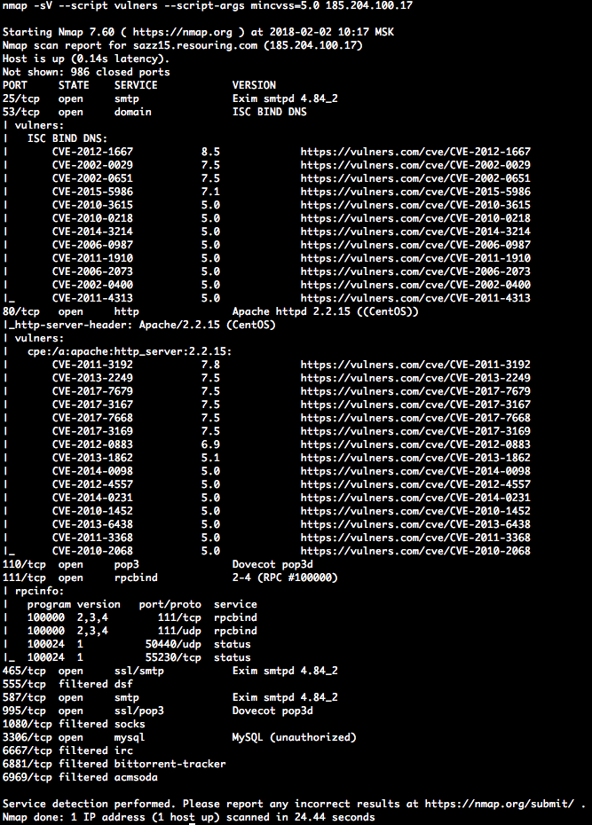

# nmap_vulners

## Descrição 
O script NSE usa informações sobre serviços conhecidos para fornecer dados sobre vulnerabilidades. Observe que ele já está incluído na biblioteca nmap NSE padrão.

## Dependências 
    nmap libraries:
        http
        json
        string
    http-vulners-regex

Lembre-se de que o script depende de informações sobre as versões do software, portanto, ele só funciona com uma flag -sV.

**NB:** Agora ele pode realmente ser executado sem a flag -sV se o script http-vulners-regex também for executado.

## Instalação 
     localize onde seus scripts nmap estão localizados em seu sistema
         para o sistema *nix, pode ser ~/.nmap/scripts/ ou $NMAPDIR
         para Mac pode ser /usr/local/Cellar/nmap/<versão>/share/nmap/scripts/
         para Windows pode ser C:\Program Files (x86)\Nmap\scripts
     copie o script fornecido (vulners.nse) nesse diretório
     execute *nmap --script-updatedb* para atualizar o banco de dados do script nmap

## Uso
    Use-o da maneira mais direta possível:
         nmap -sV --script vulners [--script-args mincvss=<arg_val>] <target>
        
Afinal, é KISS.

# http-vulners-regex

## Descrição 

O script NSE verifica as respostas HTTP e identifica os CPEs para o software mencionado. Pode, portanto, aumentar a eficiência do script principal dos vulners.

Ou com os paths:

## Dependências 
    nmap libraries:
        http
        json
        string
        stdnse
        shortport
        table

## Instalação 
   localize onde o nmap está localizado em seu sistema
         para o sistema *nix pode ser ~/.nmap/ ou $NMAPDIR
         para Mac pode ser /usr/local/Cellar/nmap/<versão>/share/nmap/
         para Windows pode ser C:\Program Files (x86)\Nmap\
     copie o script fornecido (http-vulners-regex.nse) em <nmap_dir>/scripts/
     copie o json fornecido com os regexes para <nmap_dir>/nselib/data/
     copie o arquivo txt fornecido com os caminhos padrão para <nmap_dir>/nselib/data/
         note que você pode especificar seu próprio arquivo via linha de comando
     execute *nmap --script-updatedb* para atualizar o banco de dados do script nmap

## Uso
     Como um script NSE usual:
         nmap --script http-vulners-regex.nse [--script-args paths={"/"}] <target>
